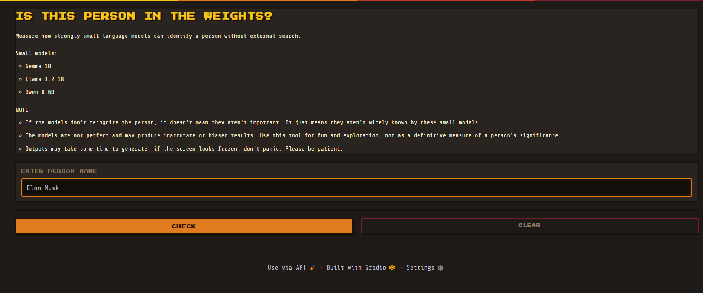
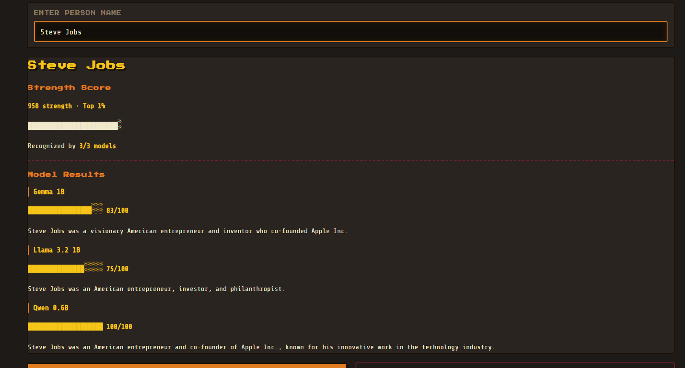

# In The Weights

Measure how strongly small language models can identify a person **without external search, retrieval, or tools**.

Inspired by the [project](https://intheweights.com/)  and question:

> Is a person "in the weights" of a small language model?

This project tests whether small open-weight language models can recognize a person from their internal knowledge alone and estimates a **Strength Score** based on recognition quality and cross-model agreement.

---

## What Are The Weights?

Large language models encode knowledge through billions of learned numerical parameters known as **weights**.

When a model can identify a person without using web search, databases, or retrieval systems, that information is effectively represented somewhere within those learned parameters.

Being "in the weights" means a model can recall information about a person from training rather than from external tools.

---

## How It Works

For each person entered, the system queries multiple small language models independently:

```text
Who is <person>?

Give a short factual description in one sentence.
```

Each response is evaluated to determine:

* Whether the model recognized the person
* The quality and richness of the description
* Agreement across models

The results are combined into a single **Strength Score**.

---

## Models

Current models:

| Model        | Parameters  |
| ------------ | ----------- |
| Gemma 1B     | 1 Billion   |
| Llama 3.2 1B | 1 Billion   |
| Qwen 0.6B    | 600 Million |

The philosophy is simple:

> Recognition by smaller models is a stronger signal.

Smaller models have significantly less capacity and therefore tend to retain only the most prominent people, events, and concepts.

---

## Strength Score

Scores range from:

```text
0 → 1000
```

General interpretation:

| Score     | Meaning         |
| --------- | --------------- |
| 950–1000  | Top 1%          |
| 850–949   | Top 5%          |
| 700–849   | Top 10%         |
| 500–699   | Top 25%         |
| Below 500 | Emerging Signal |

The score is influenced by:

* Number of models that recognize the person
* Quality of generated descriptions
* Consistency across models

---

## Example

### Query

```text
Taylor Swift
```

### Output

```text
913 strength · Top 5%

Recognized by 3/3 models

Consensus Description

Taylor Swift is an American singer-songwriter known for her powerful vocals and emotional lyrics.
```

### Model Breakdown

```text
Gemma 1B
███████████████░░░░░ 73/100

Taylor Swift is an American singer-songwriter.
```

```text
Llama 3.2 1B
██████████████████░░ 88/100

Taylor Swift is an American singer-songwriter, record producer, and actress.
```

```text
Qwen 0.6B
████████████████████ 100/100

Taylor Swift is an American singer-songwriter known for her powerful vocals and emotional lyrics.
```

---

## Why Small Models?

Many modern systems can answer questions using:

* Web search
* Retrieval systems
* External databases
* Tool usage

This project intentionally avoids all of those.

Small models provide a clearer signal of what information is truly encoded inside the model itself.

---


## HuggingFace Space

Space:

**[Click here](https://huggingface.co/spaces/nharshavardhana/in-the-weights)**


---

## Running Locally

### Clone

```bash
git clone https://github.com/HarshavardhanaNaganagoudar/in-the-weights.git

cd in-the-weights
```

### Install

```bash
pip install -r requirements.txt
```

### Run

```bash
python app.py
```

Open:

```text
http://localhost:7860
```

---

## 🖼️ App Screenshots

| Input Screen  | Output Screen | 
|-------------|---------------|
|  |  |